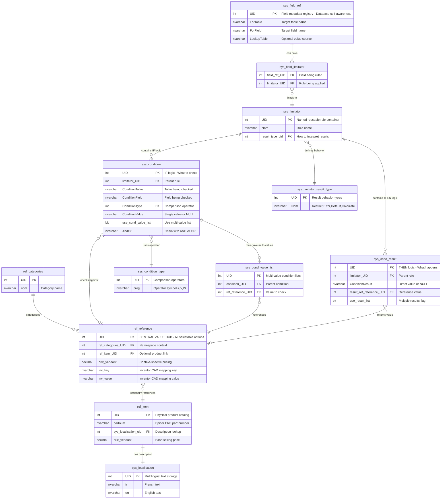

# Validation System - Quick Reference

**Last Updated**: April 21, 2026

---

## Core Architecture Pattern

```
FIELD → LIMITATOR → CONDITIONS → RESULTS
```

**Flow**: Fields have Limitators (rules) which contain Conditions (IF logic) that produce Results (THEN logic)

---

## Table Relationships Diagram

```
┌─────────────────┐
│ sys_field_ref   │ ← Field metadata registry
└────────┬────────┘   (ForTable, ForField, LookupTable...)
         │
         │ (defines)
         ▼
┌──────────────────────┐
│ sys_field_limitator  │ ← Many-to-many binding
└──────────┬───────────┘   (field_ref_UID ↔ limitator_UID)
           │
           ▼
┌──────────────────────┐
│   sys_limitator      │ ← Named rule groups
└──────┬───────┬───────┘   (Nom, result_type_uid)
       │       │
       │       └──────────────────────┐
       │                              │
       ▼                              ▼
┌──────────────────┐         ┌─────────────────┐
│  sys_condition   │         │ sys_cond_result │
└────┬─────────────┘         └────┬────────────┘
     │                            │
     │ (ConditionType)            │ (ResultValue)
     ▼                            ▼
┌──────────────────────┐   ┌──────────────────────┐
│ sys_condition_type   │   │   ref_reference      │ ← CENTRAL VALUE HUB
└──────────────────────┘   └──────┬───────┬───────┘
     (=, >, IN, etc.)              │       │
                                   │       └─────────────┐
     ┌─────────────────────────────┘                     │
     │                                                    │
     ▼                                                    ▼
┌──────────────────────┐                       ┌─────────────────┐
│sys_cond_value_list   │                       │   ref_item      │
└──────────────────────┘                       └────┬────────────┘
  (multi-value lists)                               │
                                                    ▼
┌──────────────────────┐                       ┌─────────────────┐
│sys_limitator_result  │                       │sys_localisation │
│     _type            │                       └─────────────────┘
└──────────────────────┘                         (fr, en text)
  (defines result behavior)
```

---

## Entity-Relationship Diagram (Mermaid)



**Diagram Key**:
- **Reference Layer (top)**: Value domain - what exists and can be selected
- **Rule Engine Core (middle)**: Metadata and rule containers  
- **Condition/Result Mechanics (bottom)**: How rules evaluate and execute

**Critical Relationships**:
- `ref_reference` ← Both conditions and results point here (CENTRAL HUB)
- `ref_item_UID` can be NULL (virtual options like "None", "N/A")
- `sys_field_limitator` = Many-to-Many binding (one rule → many fields, one field → many rules)
- Conditions chain via `AndOr` field for complex logic
- Results can be single value or multi-value lists

---

## Table Roles Summary

### Reference Layer (Value Domain)

| Table | Role | Key Insight |
|-------|------|-------------|
| **ref_reference** | Universal value lookup - ALL selectable options | Conditions & results reference this |
| **ref_item** | Base item catalog with pricing & localization | Description source for ref_reference |
| **ref_categories** | Value namespaces (door colors vs room colors) | Organizes ref_reference entries |
| **sys_localisation** | Multilingual text storage (fr, en) | Powers all display text |

### Rule Engine Layer

| Table | Role | Key Insight |
|-------|------|-------------|
| **sys_field_ref** | Field metadata - what fields exist & how they behave | Database "self-awareness" |
| **sys_field_limitator** | Binds fields to rules (many-to-many) | Activates rules for fields |
| **sys_limitator** | Named rule containers | Reusable across multiple fields |
| **sys_condition** | IF logic - what to check | Multiple conditions chain with AND/OR |
| **sys_condition_type** | Comparison operators (=, >, IN) | Determines single vs list values |
| **sys_cond_value_list** | Multi-value condition lists | For IN/NOT IN operators |
| **sys_cond_result** | THEN logic - what happens | Multiple possible results |
| **sys_limitator_result_type** | How to interpret results | Restrict, error, default, calculate |

### Master Query Interface

| View | Role | Critical Feature |
|------|------|------------------|
| **vw_eli5_sys_field_change_impact** | **THE MASTER VIEW** - Complete denormalized rule catalog | 40+ columns, operational interface for runtime |
| **vw_flat_cond_list** | Flattens multi-value condition lists | Comma-separated display text |
| **vw_flat_cond_results** | Flattens multi-value result lists | Handles different result types |

---

## Data Flow: Value Resolution

**How display text is resolved**:

```
ref_reference.UID (stored in conditions/results)
    ↓
ref_reference.ref_item_UID
    ↓
ref_item.sys_localisation_uid
    ↓
sys_localisation.fr (or .en)
    ↓
"Rouge" (display text)
```

**Used in**:
- vw_flat_cond_list: Shows what values conditions check
- vw_flat_cond_results: Shows what values results return
- vw_eli5_sys_field_change_impact: Full explanation with display text

---

## Query Patterns

### Get all rules for a field
```sql
SELECT * FROM vw_eli5_sys_field_change_impact 
WHERE ForTable = 'trx_porte' AND ForField = 'couleur'
```

### Find what rules check a field
```sql
SELECT * FROM vw_eli5_sys_field_change_impact
WHERE ConditionTable = 'trx_porte' AND ConditionField = 'hauteur'
```

### Get rule definition
```sql
SELECT lim.Nom, ConditionTable, ConditionField, 
       cty.prog, flat_val, result_flat_val
FROM vw_eli5_sys_field_change_impact
WHERE lim_uid = 42
```

---

## Key Concepts

### 1. Limitators are Reusable
- One limitator can apply to multiple fields
- Define once, use many times
- Centralized rule maintenance

### 2. Conditions Chain with AND/OR
```
Condition 1: height > 3000  (AndOr = 'AND')
Condition 2: width > 1200   (AndOr = 'OR')
Condition 3: type = 'Heavy'
```
Result: `(height > 3000 AND width > 1200) OR type = 'Heavy'`

### 3. Two Ways to Specify Values

**Single Value**:
- ConditionValue field has the value
- use_cond_value_list = FALSE

**Multi-Value List**:
- ConditionValue is NULL
- use_cond_value_list = TRUE
- Values in sys_cond_value_list table

### 4. Two Ways to Specify Results

**Direct Value**:
- ConditionResult field has the value
- use_result_list = FALSE

**Multi-Value List**:
- use_result_list = TRUE
- Values in sys_cond_result table

### 5. Special Result Type uid=5
- Uses ConditionResult directly as literal text
- Doesn't reference ref_reference
- See vw_flat_cond_results CASE statement

---

## Common Result Types (Inferred)

| Type | Behavior | Example |
|------|----------|---------|
| Restrict Values | Limit dropdown options | Only show red/blue when type=Standard |
| Show Error | Display validation error | Error if height > 3000 without reinforcement |
| Show Warning | Display warning message | Warn if unusual combination |
| Set Default | Auto-populate field value | Default thickness=150 for freezers |
| Calculate Value | Compute from other fields | hinge_count = 3 if width > 1200 |
| Literal Text | Direct text result (uid=5) | Custom message text |

---

## Integration Points

### ERP (Epicor)
- ref_item.partnum → Epicor part numbers
- Pricing synchronization
- trx_project.epi_QuoteNum, epi_OrderNum

### CAD (Inventor)
- ref_reference.inv_key, inv_value → Material mappings
- Multiple uni_*_inventor tables
- BOM generation

### Application Layer
Applications should:
1. **Query vw_eli5_sys_field_change_impact** for rules
2. Cache field metadata (sys_field_ref)
3. Evaluate conditions when fields change
4. Apply results (filter, validate, default)
5. Use sys_localisation for UI text

---

## Performance Tips

### Critical Indexes
```sql
CREATE INDEX idx_field_ref_table_field 
  ON sys_field_ref(ForTable, ForField)

CREATE INDEX idx_condition_table_field 
  ON sys_condition(ConditionTable, ConditionField)

CREATE INDEX idx_field_limitator_field 
  ON sys_field_limitator(sys_field_ref_UID)
```

### Query Optimization
- Always filter vw_eli5 on ForTable/ForField or ConditionTable/ConditionField
- Cache rule definitions at application startup
- Use prepared statements with parameters
- Consider materialized views for frequently accessed rules

### Caching Strategy
```
Application Startup:
  1. Load all sys_field_ref (field metadata)
  2. Load common limitators by category
  3. Cache sys_localisation for current language

Form Load:
  1. Query vw_eli5 for field-specific rules
  2. Cache results in form context

Field Change:
  1. Evaluate cached conditions
  2. Query for impacted fields if needed
```

---

## Troubleshooting

### Field not validating?
1. Check sys_field_limitator - is field bound to limitator?
2. Check sys_condition - are ConditionTable/Field correct?
3. Check vw_eli5 - query for the field and inspect results

### Wrong values showing?
1. Check ref_reference.ref_categories_UID - correct category?
2. Check sys_cond_result.ResultValue - correct ref_reference UIDs?
3. Check vw_flat_cond_results.result_flat_val - see actual values

### Display text wrong language?
1. Check ref_item.sys_localisation_uid - correct reference?
2. Check sys_localisation - text exists for language?
3. Verify application is querying correct language column (fr vs en)

---

## Best Practices

✅ **DO**:
- Use meaningful names in limitator.Nom
- Document complex conditions in ConditionText
- Test limitators in isolation before applying to fields
- Keep condition chains shallow (max 3-4 conditions)
- Use categories to organize ref_reference values
- Leverage vw_eli5 for ALL rule queries

❌ **DON'T**:
- Create circular dependencies (Field A → Field B → Field A)
- Mix different value categories in same condition
- Use ConditionValue for list-based conditions (use sys_cond_value_list)
- Query individual sys_* tables when vw_eli5 exists
- Forget to bind limitators to fields via sys_field_limitator

---

**Quick Start**: Query `vw_eli5_sys_field_change_impact` with no WHERE clause to see all rules in the system.
