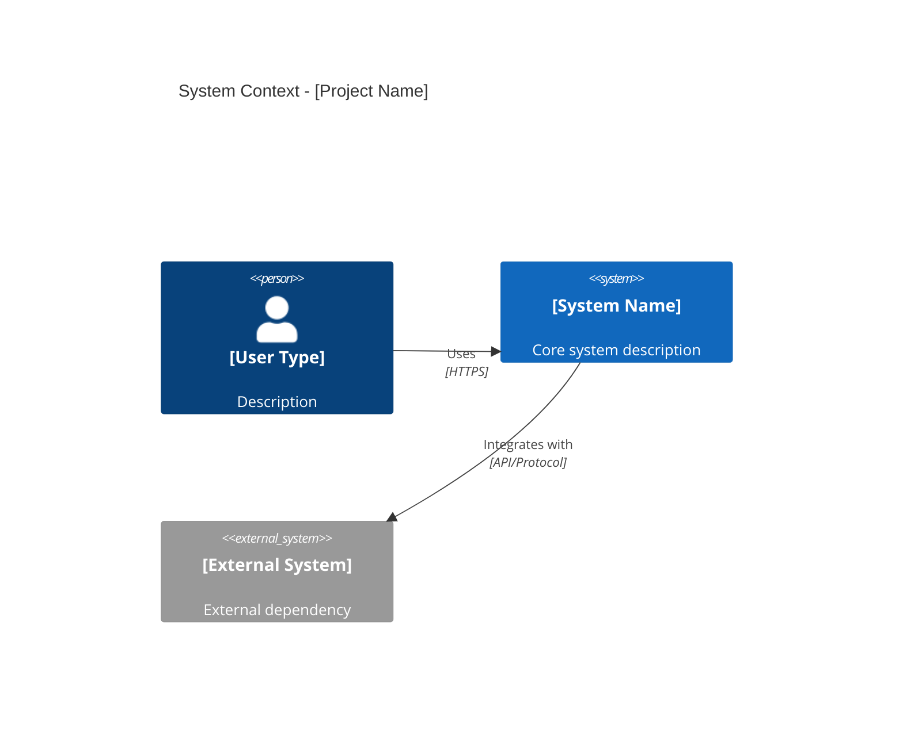
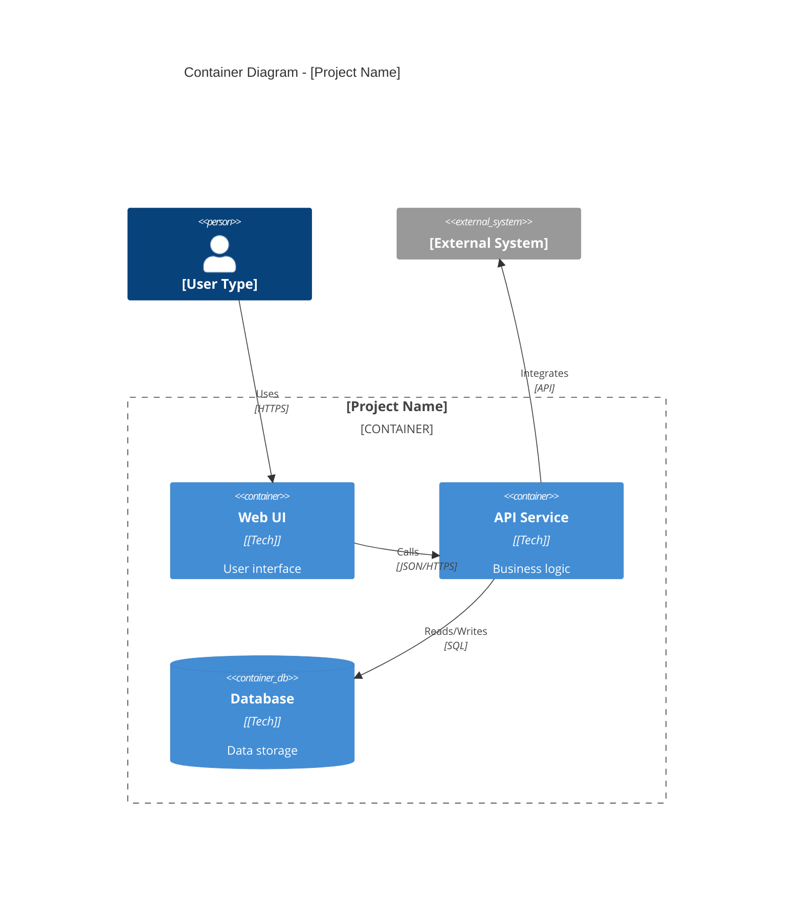

# Architecture Documentation Guide

**Purpose**: Project-agnostic guide for creating and maintaining architecture documentation.

**Location**: This guide lives in `.docs/Architecture.md` (template repository)  
**Project docs**: Actual architecture documents go in `docs/Architecture/` (project-specific)

---

## Overview

Architecture documentation follows a **three-document pattern** with optional decision records:

| Document | Purpose | Created When | Size Limit |
|----------|---------|--------------|------------|
| `brief.md` | Requirements, constraints, tech stack | Inception (Phase 0a-0b) | 2-5 pages |
| `architecture-reference.md` | System design, patterns, layers | Inception (Phase 0c) | <500 lines |
| `diagrams/*.md` | Visual architecture (Mermaid/C4) | Inception (Phase 0d) | As needed |
| `adr/*.md` | Architecture Decision Records | Ongoing | 1-2 pages each |

**Principle**: Prefer linking to detailed docs over inline expansion. Keep always-loaded context low-entropy.

---

## File Organization

**Project-Specific Documentation** (in `docs/`):
```
docs/Architecture/
├── brief.md                    # Project requirements & constraints
├── architecture-reference.md   # PRIMARY architecture doc
├── diagrams/
│   ├── system-context.md       # C4 Level 0 (required)
│   ├── container-diagram.md    # C4 Level 1 (multi-service)
│   └── [component].md          # C4 Level 2+ (optional)
└── adr/
    ├── _TEMPLATE.md            # MADR 3.0.0 template
    ├── 0001-[decision].md
    └── 0002-[decision].md
```

**Template/Guidance** (in `.docs/`):
```
.docs/
├── Architecture.md             # This guide (template)
├── patterns/                   # Reusable architecture patterns
├── standards/                  # Standards (diagrams, etc.)
└── ContextEngineering/         # Document generation prompts
```

---

## Document Lifecycle

### Phase 0: Inception (40-75 minutes)

**0a. Discovery Session** (15-30 min)
- Gather requirements via structured conversation
- Identify constraints (budget, timeline, compliance)
- Define tech stack preferences

**0b. Brief Synthesis** (5-10 min)
- Generate `docs/Architecture/brief.md` from discovery session
- Validate against schema

**0c. Architecture Reference** (10-15 min)
- Generate `docs/Architecture/architecture-reference.md` from brief
- Create initial ADRs in `docs/Architecture/adr/` (2-5 major decisions)

**0d. Diagram Conversation** (10-20 min)
- Guided conversation determines needed C4 levels
- Generate Mermaid diagrams in `docs/Architecture/diagrams/`
- Always create Level 0 (System Context)
- Create Level 1 (Container) if multi-service

### Phase 1+: Development & Maintenance

**During development:**
- Update `docs/Architecture/architecture-reference.md` as system evolves
- Add ADRs in `docs/Architecture/adr/` for major decisions
- Update diagrams in `docs/Architecture/diagrams/` when architecture changes

**Quarterly:**
- Review architecture docs vs actual code
- Archive superseded ADRs to `docs/Archive/Architecture/`
- Update diagrams if patterns changed

---

## The Brief (`brief.md`)

**Purpose**: Define project scope, requirements, and constraints.

**Contents**:
- **Business Intent**: What problem are you solving?
- **Key Requirements**: Must-have features
- **Tech Stack**: Languages, frameworks, databases
- **Constraints**: Budget, timeline, compliance, existing systems
- **Success Criteria**: How you'll measure success

**Keep it**: 2-5 pages, business-language focused, decision-oriented

**Example structure**:
```markdown
# Project Brief: [Name]

## Problem Statement
[1-2 paragraphs describing the business problem]

## Key Requirements
1. [Requirement]
2. [Requirement]
3. [Requirement]

## Tech Stack
- Backend: [framework]
- Frontend: [framework]
- Database: [database]
- Deployment: [platform]

## Constraints
- Timeline: [duration]
- Budget: [budget]
- Existing Systems: [integrations]

## Success Criteria
- [Measurable outcome]
- [Measurable outcome]
```

---

## Architecture Reference (`architecture-reference.md`)

**Purpose**: PRIMARY technical architecture document. Single source of truth for system design.

**Contents**:
- System overview and key components
- Layer boundaries and responsibilities
- Data models and relationships
- Key patterns (hexagonal, BFF, event-driven, etc.)
- Technology stack decisions
- File organization

**Keep it**: <500 lines. Link to deeper docs rather than inline expansion.

**Structure template**:
```markdown
# [Project Name] Architecture Reference

**Date**: YYYY-MM-DD
**Status**: [Proposed|Approved|Implemented]
**Pattern**: [Architecture pattern name]

## Overview
[2-3 paragraph summary + ASCII diagram]

## Layer Definitions
| Layer | Purpose | Allowed | Forbidden |
|-------|---------|---------|-----------|
| [Layer] | [Description] | [Allowed operations] | [Forbidden operations] |

## Technology Stack
| Component | Technology | Rationale |
|-----------|-----------|-----------|
| [Component] | [Tech] | [Why chosen] |

## File Organization
[Directory tree showing structure]

## Data Models
[Key entities and relationships]

## Design Principles
[Guiding principles for this architecture]
```

---

## Architecture Decision Records (`adr/`)

**Purpose**: Document significant architecture decisions with context and rationale.

**Format**: MADR 3.0.0 (Markdown Architecture Decision Records)

**When to create ADRs**:
- ✅ Architectural pattern choices (hexagonal, microservices, layered)
- ✅ Major technology decisions (database, framework, cloud provider)
- ✅ Integration strategies (REST vs GraphQL, sync vs async)
- ✅ Refactors changing patterns, layers, or component boundaries
- ❌ Minor library choices or coding style preferences

**Lifecycle**:
1. **Initial ADRs** (Phase 0c): 2-5 decisions from brief
2. **Development ADRs**: Created when architecture changes
3. **Status updates**: Accepted → Deprecated/Superseded

**File naming**: `XXXX-[short-title].md` (e.g., `0001-use-fastapi.md`)

**Template structure**:
```markdown
# ADR XXXX: [Title]

**Date**: YYYY-MM-DD
**Status**: [Proposed|Accepted|Deprecated|Superseded by ADR-YYYY]

## Context
[What is the issue motivating this decision?]

## Decision
[What is the change we're proposing/doing?]

## Consequences
**Positive:**
- [Benefit]

**Negative:**
- [Cost/risk]

**Neutral:**
- [Trade-off]

## Alternatives Considered
1. [Alternative 1] - [Why rejected]
2. [Alternative 2] - [Why rejected]
```

---

## Diagrams (`diagrams/*.md`)

**Standard**: Mermaid with C4 Model notation

**Why Mermaid?**
- Text-based (git-friendly, diff-able)
- Native GitHub/GitLab rendering
- VS Code preview built-in
- C4 diagram support via mermaid-c4 syntax

### C4 Model Levels

| Level | Purpose | Required? | When to Create |
|-------|---------|-----------|----------------|
| **0 - System Context** | System boundary, users, external systems | ✅ **REQUIRED** | Always (Phase 0d) |
| **1 - Container** | Services, databases, relationships | ✅ Multi-service | Phase 0d |
| **2 - Component** | Internal service components | ⚠️ Optional | Phase 0d or Phase 4 |
| **3 - Code** | Class-level for critical use cases | ⚠️ Optional | As needed |
| **4 - Deployment** | Infrastructure topology | ⚠️ Optional | Phase 6 |

**Guided approach**: Use Phase 0d conversation to determine needed levels based on project complexity.

### File Naming

Pattern: `{type}-{scope}.md` (Markdown files with Mermaid code blocks)

**Examples**:
- `system-context.md` - Level 0 (always required)
- `container-diagram.md` - Level 1 (services)
- `api-component.md` - Level 2 (service internals)
- `auth-sequence.md` - Specific flow diagram

### Level 0 Template (System Context - REQUIRED)

```markdown
# System Context Diagram


```

### Level 1 Template (Container - Multi-Service)

```markdown
# Container Diagram


```

### Mermaid Tooling

**VS Code**: Built-in Markdown preview renders Mermaid automatically  
**GitHub/GitLab**: Native rendering in Markdown files  
**Web Editor**: [mermaid.live](https://mermaid.live) for testing diagrams  
**Extensions**: Mermaid Preview (VS Code) for enhanced features

---

## Layer Patterns

### Common Architecture Patterns

**Single-Service (Monolith)**
```
UI → API (Routes → Business Logic → Data Access) → Database
```

**Multi-Service (Microservices)**
```
UI → BFF → [Service A, Service B, Service C] → [Database A, Database B]
```

**Hexagonal (Ports & Adapters)**
```
Routes → Process Layer (Business) → Adapter Layer (Technical) → External Systems
```

**Event-Driven**
```
Service A → Message Bus (Kafka/RabbitMQ) → [Service B, Service C]
```

**For detailed pattern guidance:**
- 📎 [patterns/architecture/](patterns/architecture/) - Complete architecture patterns with when-to-use guidance
- 📎 [ArchitectureGrowthPath.md](ArchitectureGrowthPath.md) - Evidence-based evolution from MVP to production
- 📎 [USAGE_GUIDE.md](USAGE_GUIDE.md) - Pattern selection decision framework

### Layer Responsibility Template

Document clear boundaries for your chosen pattern:

| Layer | Purpose | Allowed | Forbidden |
|-------|---------|---------|-----------|
| [Layer Name] | [What it does] | [Allowed dependencies] | [Forbidden dependencies] |

**Example (Hexagonal)**:
| Layer | Purpose | Allowed | Forbidden |
|-------|---------|---------|-----------|
| Process | Business workflows | Orchestrate adapters | Direct external API calls |
| Adapters | External integrations | Use external libraries | Business logic |
| Routes | HTTP handling | Request validation | Business logic |

---

## Best Practices

### Document Simplicity Principle

**Apply recursive layering**:
- Documents >300 lines → split into overview + reference
- Always-loaded context stays <500 lines
- Link to detailed docs rather than inline expansion

### Naming Conventions

**Files**:
- `brief.md` - lowercase, descriptive
- `architecture-reference.md` - primary doc
- `diagrams/system-context.md` - kebab-case
- `adr/0001-use-fastapi.md` - numbered, kebab-case

**Diagrams**:
- Use consistent C4 notation
- Keep ASCII diagrams <80 chars wide
- Include legend/key if using custom symbols

### Update Frequency

| Document | Update When |
|----------|-------------|
| `brief.md` | Scope changes, major pivots |
| `architecture-reference.md` | Pattern changes, new layers/services |
| `diagrams/*.md` | Architecture changes, quarterly reviews |
| `adr/*.md` | Major decisions, refactors |

### Archive Policy

**Move to `docs/Archive/Architecture/` when**:
- ADR superseded by newer decision (update status field)
- Architecture completely redesigned (keep for historical reference)
- Diagrams no longer reflect current system

**Always maintain**: `docs/Archive/ARCHIVE_INDEX.md` with archival metadata

---

## Quick Reference

**Starting a new project?**
1. Run Phase 0a-0b → Create `docs/Architecture/brief.md`
2. Run Phase 0c → Create `docs/Architecture/architecture-reference.md` + initial ADRs
3. Run Phase 0d → Create `docs/Architecture/diagrams/system-context.md` (+ container if multi-service)

**Adding a major feature?**
1. Update `docs/Architecture/architecture-reference.md` if patterns change
2. Create ADR in `docs/Architecture/adr/` if decision is architecturally significant
3. Update diagrams in `docs/Architecture/diagrams/` if components added/removed

**Quarterly maintenance?**
1. Review `docs/Architecture/` vs actual code
2. Update diagrams if drift detected
3. Archive superseded ADRs to `docs/Archive/Architecture/`
4. Check for >300 line docs needing split

**Understanding the distinction:**
- **`.docs/`** = Templates, patterns, standards, guidance (this file)
- **`docs/`** = Your actual project documentation (brief, architecture-reference, ADRs)

---

---

**Template Version:** 1.0.0  
**Last Updated:** 2026-04-17  
**Source**: Distilled from `.docs/Architecture/` guidance files

**Key Distinction:**
- This file (`.docs/Architecture.md`) = Project-agnostic template/guidance
- Your project docs (`docs/Architecture/`) = Project-specific implementation
